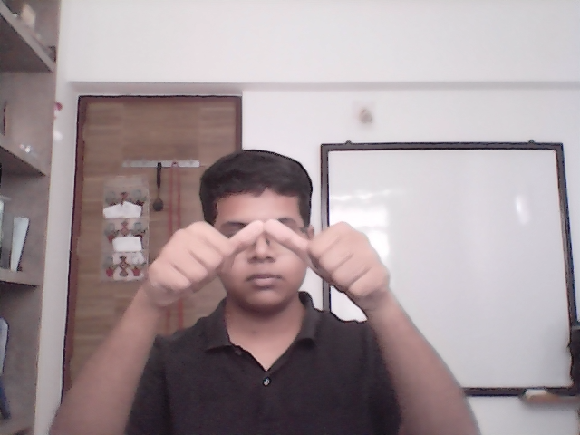
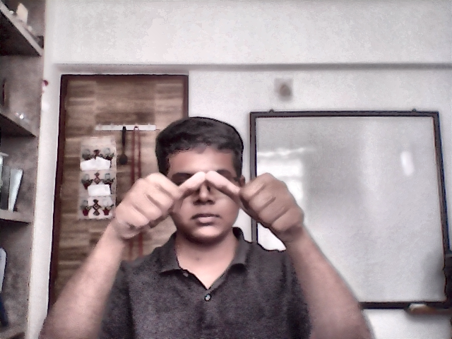
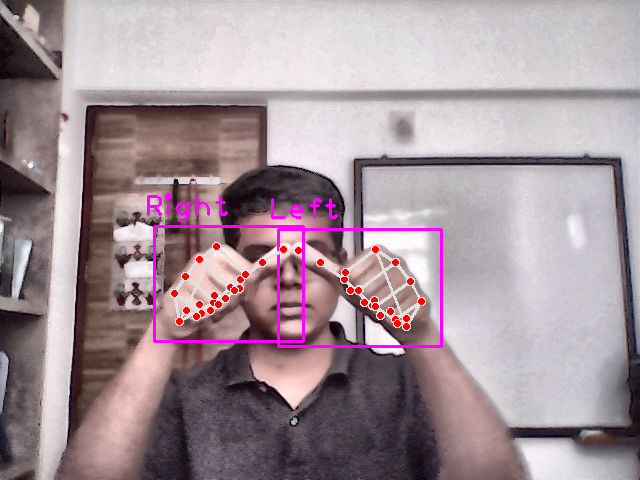
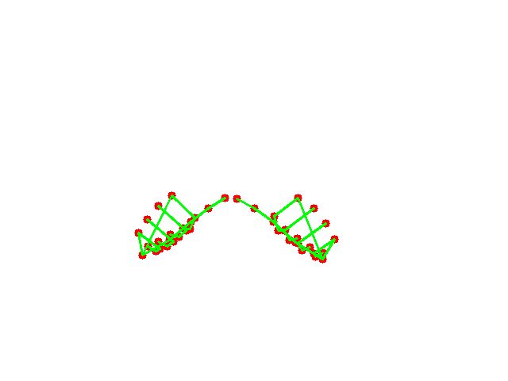
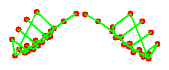
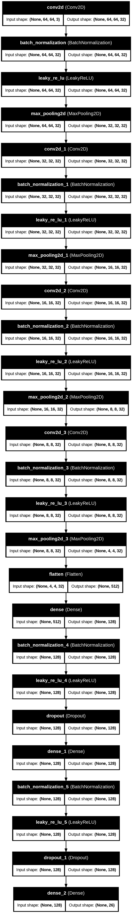

# Sign Companion 🚀

Sign Companion is a full-stack web application developed using deep learning, computer vision, and web technologies. It is designed to assist differently-abled individuals, particularly those who are deaf, mute, or blind, by translating Indian Sign Language (ISL) into text and converting text or speech into sign language.

## Table of Contents 📑

| **Overview**                         | **Features**                           | **User Interface**                | **Performance**                     | **Additional Information**          |
|--------------------------------------|----------------------------------------|----------------------------------|------------------------------------|-------------------------------------|
| [Sign Companion](#sign-companion)     | [Sign to Text](###sign-to-text)         | [Sign to Text](#sign-to-text)       | [Confusion Matrix](###confusion-matrix) | [Purpose](##purpose)                 |
| [Technology Stack](##technology-stack) | [Text to Sign](###text-to-sign)         | [Text to Sign](#text-to-sign)       | [Accuracy and Loss Graphs](###training-and-testing-accuracyloss-graphs) | [Contribution](##contribution)       |
|                                      | [Speech to Sign](###speech-to-sign)      | [Speech to Sign](#speech-to-sign)   | [Model Architecture](###model-architecture) | [Future Enhancements](##future-enhancements) |
|                                      |                                        | [Contact Us](#contact-us)          |                                    |                                     |
|                                      |                                        | [About Us](#about-us)              |                                    |                                     |
|                                      |                                        | [Login](#login)                    |                                    |                                     |
|                                      |                                        | [Signup](#signup)                  |                                    |                                     |

---

## User Interface 🖼️

### Sign to Text 
- **Description:** The user uploads or captures a photo of their hand showing a specific ISL sign. The system translates this sign into text.
- **UI Screenshot:**

  

### Text to Sign 
- **Description:** Users can enter text, which is then converted into corresponding ISL signs and displayed.
- **UI Screenshot:**

  
  

### Speech to Sign 
- **Description:** Users speak into the microphone, and the spoken words are converted into ISL signs.
- **UI Screenshot:**

  
  

### Contact Us 
- **Description:** The contact us page allows users to reach out for support or inquiries.
- **UI Screenshot:**

  

### About Us 
- **Description:** Provides information about the project and its purpose.
- **UI Screenshot:**

  

### Login 
- **Description:** Allows users to log in to their accounts.
- **UI Screenshot:**

  

### Signup 
- **Description:** Users can create a new account through this page.
- **UI Screenshot:**

  

---

## Key Features 🌟

### 1. Sign to Text 
This feature translates Indian Sign Language (ISL) signs into corresponding text, making communication easier for individuals who use ISL. The process involves several steps to ensure accurate recognition and translation of the sign. Here’s a detailed overview:

1. **Take a Normal Picture:**  
   - **Description:** The user captures or uploads a photo of their hand showing a specific ISL sign. This initial image serves as the input for the sign recognition process.
   - **Image Example:**

     
   
2. **Add Contrast:**  
   - **Description:** Contrast is adjusted to enhance the visibility of the hand, especially if the picture is of low quality or poorly lit. This step helps in better distinguishing the hand from the background.
   - **Image Example:**

     

3. **Hand Detection Using cvzone Library:**  
   - **Description:** The `cvzone` library is used to detect the hand and its key points within the image. This step identifies critical points such as the coordinates of fingers and key landmarks on the hand.
   - **Image Example:**

     

4. **Isolate Hand and Key Points:**  
   - **Description:** The background of the image is made completely white, and only the detected hand and its key points are highlighted. This isolates the hand from any extraneous elements in the image.
   - **Image Example:**

     

5. **Crop the Hand:**  
   - **Description:** The image is cropped to remove excess white space around the hand, ensuring that only the relevant part of the image (the hand) is processed for classification.
   - **Image Example:**

     

### 2. Text to Sign 
This feature converts text input into sign language. The process is as follows:

- **Extract Each Character from Text:**  
  - The system extracts each character from the given text.
  
- **Fetch Corresponding Sign Image:**  
  - For each character, the corresponding image representing that letter in ISL is fetched and displayed.

### 3. Speech to Sign 
This feature converts spoken words into sign language:

1. **Generate Transcript from Speech:**  
   - The user’s speech is captured using a speech recognition library in React. The speech is transcribed into text.

2. **Convert Text to Sign:**  
   - Once the text is generated, the same process as the "Text to Sign" feature is applied. Each character from the transcript is fetched and displayed as the corresponding sign image.

---

## Technology Stack 🛠️

- **Backend:** Django
- **Frontend:** React, HTML, CSS, JavaScript
- **Deep Learning Model:** TensorFlow-based Convolutional Neural Network (CNN) trained on a custom dataset of 31,200 training samples and 6,240 testing samples, achieving 99% accuracy.

---

## Training and Testing Image Examples 🖼️

### Training Images 
These are some examples of images used for training the model:

   - **Description:** An example image from the training dataset showing the ISL sign for different letters.
   - **Image:**
     
     

### Testing Images 
These are some examples of images used for testing the model:

   - **Description:** An example image from the testing dataset showing different signs for different letters.
   - **Image:**

     

---

## Model Performance 📈

### 1. Confusion Matrix 
The confusion matrix is used to visualize the performance of the model on the test dataset. It shows the number of correct and incorrect classifications for each sign:

  

### 2. Training and Testing Accuracy/Loss Graphs 
The following graphs display the training and testing accuracy and loss over epochs:

- **Training and Testing Accuracy:**

  

- **Training and Testing Loss:**

  

### 3. Model Architecture 
The CNN architecture used for training the model is as follows:

- **Input Layer:** Process the image input.
- **Convolutional Layers:** Multiple convolution layers are applied to extract features from the images.
- **Max Pooling Layers:** Reduce the dimensionality of feature maps while retaining important information.
- **Fully Connected Layer:** Flatten the feature maps and pass them through fully connected layers for classification.
- **Output Layer:** Classify the image into the corresponding ISL alphabet.

Here’s a visual representation of the model architecture:

---

## Purpose 🎯

Sign Companion aims to bridge the communication gap for individuals who are differently-abled, particularly by translating Indian Sign Language (ISL). It is designed to be user-friendly and accessible to all, whether or not they are familiar with ISL.

### Use Cases 🌐
- Differently-abled individuals can communicate more easily with others.
- Anyone can learn and communicate in Indian Sign Language through text or speech.

---

## Contribution 🤝
Contributions and feedback are welcome! Please feel free to open issues or submit pull requests to improve the platform.

---

## Future Enhancements 🚀
- Expand the dataset to include more signs and gestures.
- Add support for additional languages and sign systems.
- Improve speech-to-sign accuracy and robustness.
